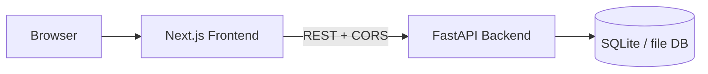

# Form Builder Implementation Plan

## Overview

Greenspace form builder using `frontend/` for Next.js App Router and `backend/` for FastAPI. The app supports authenticated creators for builder and responses, with unauthenticated public form filling for published forms.

## Core product scope

The product has three primary surfaces:

- Form builder for creators
- Public form view for respondents
- Responses dashboard for creators

Core backend routes:

- `POST /forms`
- `GET /forms/{id}`
- `PUT /forms/{id}`
- `POST /forms/{id}/submit`
- `GET /forms/{id}/responses`

## Architecture




Frontend stack:

- Next.js App Router
- TypeScript strict mode
- Tailwind CSS
- shadcn/ui
- TanStack Query
- `@dnd-kit` for builder reordering
- Email/password auth against the FastAPI API (JWT in `Authorization` header)

Backend stack:

- FastAPI
- Pydantic v2
- async SQLAlchemy 2.x
- Alembic migrations
- SQLite by default (`sqlite+aiosqlite`); portable JSON columns
- HS256 JWT verification for protected routes (`JWT_SECRET`)

## Repository layout

Use a flat project structure:

- `frontend/` - Next.js app
- `backend/` - FastAPI app

Suggested layout:

```text
frontend/
  app/
  components/
  lib/
  hooks/
  types/

backend/
  app/
    core/
    db/
    models/
    schemas/
    repositories/
    services/
    routers/
  tests/
  alembic/
```

## Auth model

Authenticated users are form creators. Public respondents do not need accounts.

Protected creator flows:

- Create a form
- Edit a form
- Publish or unpublish a form
- View responses for owned forms

Public flows:

- View a published form
- Submit a published form

Route auth rules:

- `POST /forms` - auth required
- `GET /forms/{id}` - public for published forms, owner-only for drafts
- `PUT /forms/{id}` - auth required, owner-only
- `POST /forms/{id}/submit` - public
- `GET /forms/{id}/responses` - auth required, owner-only

## Current MVP field inputs

The initial builder and runtime should support these field types:

- Short text
- Long text
- Email
- Phone number
- Checkbox
- Yes/No radio
- Address
- Date of birth

Recommended internal field type IDs:


| UI label      | `type` value    | Notes                                     |
| ------------- | --------------- | ----------------------------------------- |
| Short text    | `short_text`    | Single-line text input                    |
| Long text     | `long_text`     | Multiline textarea                        |
| Email         | `email`         | HTML email input + backend validation     |
| Phone number  | `phone_number`  | Tel input + normalized validation         |
| Checkbox      | `checkbox`      | Single boolean checkbox                   |
| Yes/No        | `yes_no`        | Radio group with fixed yes/no options     |
| Address       | `address`       | Structured object value                   |
| Date of birth | `date_of_birth` | Date input in DD-MM-YYYY (day-month-year) |


## Field modeling approach

Use `fields.config` as JSONB for field-specific settings, while keeping shared metadata in columns.

Shared field shape:

- `id`
- `form_id`
- `order`
- `type`
- `label`
- `required`
- `config`

Suggested value shapes:


| Field type      | Submitted value shape                                 |
| --------------- | ----------------------------------------------------- |
| `short_text`    | `string`                                              |
| `long_text`     | `string`                                              |
| `email`         | `string`                                              |
| `phone_number`  | `string`                                              |
| `checkbox`      | `boolean`                                             |
| `yes_no`        | `"yes"` or `"no"`                                     |
| `address`       | `{ line1, line2, city, state, postal_code, country }` |
| `date_of_birth` | `DD-MM-YYYY` string (day, month, year)                |


Suggested config examples:

```json
{
  "short_text": { "placeholder": "Enter your answer", "max_length": 120 },
  "long_text": { "placeholder": "Tell us more", "rows": 4, "max_length": 2000 },
  "email": { "placeholder": "name@example.com" },
  "phone_number": { "placeholder": "+1 555 123 4567" },
  "checkbox": { "checkbox_label": "I agree to the terms" },
  "yes_no": { "options": ["yes", "no"] },
  "address": {
    "fields": ["line1", "line2", "city", "state", "postal_code", "country"]
  },
  "date_of_birth": { "date_format": "DD-MM-YYYY", "placeholder": "15-04-1990" }
}
```

## Data model

Start with a `users` table for creators plus three main tables and JSON answers for speed of delivery.

### `users`

- `id`
- `email` (unique)
- `password_hash`
- `created_at`

### `forms`

- `id`
- `owner_id`
- `title`
- `slug`
- `status` (`draft` or `published`)
- `created_at`
- `updated_at`

Indexes:

- unique index on `slug`
- index on `owner_id`

### `fields`

- `id`
- `form_id`
- `order`
- `type`
- `label`
- `required`
- `config`
- `created_at`

Indexes:

- composite index on `(form_id, order)`

### `responses`

- `id`
- `form_id`
- `submitted_at`
- `answers`

`answers` should start as JSONB keyed by field id or as a list of answer objects. Keep it simple for MVP and normalize later only if analytics requirements demand it.

## Backend implementation plan

Structure the API into clear layers:

- `routers/` for HTTP concerns only
- `services/` for business rules
- `repositories/` for database access
- `schemas/` for request and response contracts
- `core/security.py` + `core/auth.py` for password hashing and JWT verification

Key backend responsibilities:

1. Create and update forms with ordered fields.
2. Validate submissions against the current published form definition.
3. Enforce owner authorization on builder and response routes.
4. Return paginated response data for the dashboard.
5. Keep error responses consistent and typed.

Submission validation rules by field:

- `short_text` and `long_text`: validate string type and optional length rules
- `email`: validate email format
- `phone_number`: validate normalized phone-like input
- `checkbox`: validate boolean
- `yes_no`: validate only `"yes"` or `"no"`
- `address`: validate required address subfields when enabled
- `date_of_birth`: validate DD-MM-YYYY (day, month, year)

## Frontend implementation plan

### Builder

The builder page should support:

- Creating and editing form metadata
- Adding supported field types from the MVP list
- Reordering fields with `@dnd-kit`
- Editing field label, required state, and field-specific config
- Saving via `PUT /forms/{id}`
- Publishing and unpublishing forms

### Public form runtime

The public form page should:

- Render fields based on the saved schema
- Use the correct control for each field type
- Perform lightweight client validation before submit
- Submit to `POST /forms/{id}/submit`
- Show success and error states clearly

### Responses dashboard

The dashboard should:

- Fetch `GET /forms/{id}/responses`
- Show paginated submissions
- Render answer values in a readable format
- Handle address and date values cleanly

## API contract planning

Core request and response contracts should include:

- `FormCreate`
- `FormUpdate`
- `FormRead`
- `FieldCreate`
- `FieldRead`
- `FormSubmit`
- `ResponseRead`
- `ResponsesPage`

For field typing, prefer discriminated unions in Pydantic and matching TypeScript unions in the frontend so each field type has an explicit config and answer shape.

## Development order

1. Scaffold `frontend/` and `backend/`.
2. Add backend database models, Alembic, and initial migrations.
3. Implement Pydantic schemas for forms, fields, and submissions.
4. Implement protected and public API routes with owner checks.
5. Add login/register UI to the frontend and wire `Authorization: Bearer` on API calls (backend JWT already implemented).
6. Build the minimal builder UI with add/edit/reorder/save flows.
7. Build the public form renderer for the eight MVP input types.
8. Build the responses dashboard with pagination.
9. Add validation, error handling, rate limiting, and test coverage.

## Todo list

- [x] **Todo 1 — Scaffold** `backend/` and `frontend/` with all dependencies, configs, and boilerplate. No feature code — just a runnable skeleton for both apps.
- [x] **Todo 2 — Database models + Alembic** SQLAlchemy async models for `forms`, `fields`, `responses`. Initial Alembic migration. No routes yet.
- [x] **Todo 3 — Pydantic schemas** All request/response schemas for forms, fields, and submissions. TypeScript mirror types in `frontend/types/`. No route changes.
- [x] **Todo 4 — API routes** Layered routers/services/repositories for all five endpoints under `/api/v1/forms`. JWT `get_current_user` / optional bearer for `GET` draft vs published. Tests for create, visibility, submit, responses ACL, slug duplicate.
- [x] **Todo 5 — Local auth (JWT)** Backend: `POST/GET /api/v1/auth/register|login|me`, bcrypt passwords, HS256 JWT (`core/security.py`, `core/auth.py`). Frontend: `/login` and `/signup` (or combined page), persist token, attach Bearer token to creator API calls, optional route guards.
- **Todo 6 — Form builder UI** Builder page: field palette (all 8 types), field editor, `@dnd-kit` reorder, save/publish toggle. Wired to `PUT /forms/{id}`.
- **Todo 7 — Public form renderer** Public form page with correct control for each of the 8 field types. Client-side validation + `POST /forms/{id}/submit`. Success/error states.
- **Todo 8 — Responses dashboard** Responses page: paginated table, readable answer rendering for all field types (address, date formatted correctly).
- **Todo 9 — Harden** Rate limiting on public submit, CORS lockdown, consistent error UX, ruff + pytest passing, eslint + tsc passing.

## Quality and testing

Backend:

- `pytest`
- `pytest-asyncio`
- `ruff`

Frontend:

- `eslint`
- `tsc --noEmit`

Important test coverage:

- Owner-only access rules
- Draft vs published visibility
- Field ordering persistence
- Submission validation for all eight MVP field types
- Response listing pagination

## Environment variables

Frontend:

- `NEXT_PUBLIC_API_URL`

Backend:

- `DATABASE_URL`
- `CORS_ORIGINS`
- `JWT_SECRET`

## Phase 2 ideas

- OpenAPI-generated TypeScript types
- Better analytics on responses
- Bot protection on public submissions
- Social login
- Additional field types

